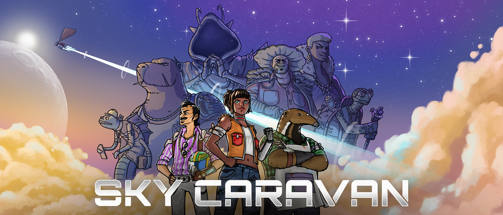
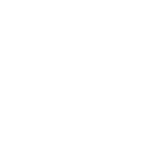

## WELCOME TO THE SKYWAYS, CARAVANEER.

Complete missions, manage your ship’s resources and make tough decisions to keep your crew alive and happy. Or not. Choices have lasting consequences in this Text-Based RPG. 

<b>You are the captain - and the clouds are waiting!</b>


  
  
  
  




### FEATURES
- Become a Sky Caravaneer, <b>an adventurer in the clouds</b>
- Discover <b>peculiar locations of a world in the skies</b>, such as the Floating Ocean, Venom Refinery or Spore Heights
- <b>Take up missions</b> and <b>make tough choices</b> with narrative and mechanical consequences through a unique reaction disks system
- <b>Manage your ship's resources</b> and <b>chill with your crew</b> in bars managed by greedy capybaras
- <b>Be wary of your shipmates' affinities changing</b> as hard decisions are made. They may become your best friends - or your fiercest rivals!
- Play alongside your community with <b>Twitch Integration</b>, allowing your followers to <b>vote on decisions through the chat!</b> [Click here for more info](https://store.steampowered.com/news/app/1792270/view/3132820191039890027?l=english).
- <b>Ultrawide</b> monitor support


BUY NOW ON STEAM!


 
 


BUY NOW ON NINTENDO SWITCH!




[Presskit](https://studiobravarda.com/sky-caravan/presskit)